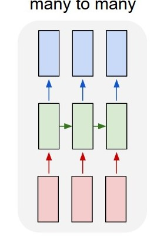
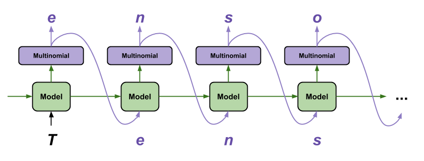

# Generate HTML Code

Implements a network that can generate HTML code. This approach will be based on files written by humans. It does not validate that the code is valid, but it can be implemented in the future. In consequence, it can be complemented with a top layer than can determine valid or not valid code. 

## Table of contents
* [Table of contents](#table-of-contents)
* [Dataset description](#dataset-description)
* [Steps](#steps)
  * [Model](#model)
    * [GRU RNN](#gru-rnn)
    * [Embedding Layer](#embedding-layer)
    * [Ingest data](#ingest-data)
    * [Dense Layer](#dense-layer)
  * [Generate text](#generate-text)
  * [Results](#results)
    * [Result Group 0](#result-group-0)
    * [Result Group 1](#result-group-1)
    * [Result Group 2](#result-group-2)
* [References](#references)
* [Extra](#extra)
  * [Useful commands](#useful-commands)

## Dataset description

The dataset was built on top of https://github.com/tb0hdan/domains, it has **150 Million** domain names. Some of them are not valid anymore. In this repo are provided scripts to fetch all those domain names and save the valid ones. The current dataset has more than **170 thousands** HTML files, they are stored in a VM provisioned by Google Cloud Platform. The size is more than 20GB.

The dataset was built for this project, the model was fed with more than **20 millions** of characters with 'utf-8' encoding.

## Steps
### Model

This model was based on a Tensorflow article. The general model looks similar to the below image. Where the red rectangles are the inputs, the green ones the state of RNN's, and the blue ones the output.

[](http://karpathy.github.io/2015/05/21/rnn-effectiveness/)

The model was built with the below code. It establishes a sequential network, in other words, for each element of the sequence, there is only one output. The model starts with an embedding part, then it is a GRU RNN, at the end it is the dense layer.

[⬆️ Return](#table-of-contents)

#### GRU RNN

```python
def build_model(vocab_size, embedding_dim, rnn_units, batch_size):
    model = tf.keras.Sequential([
        tf.keras.layers.Embedding(vocab_size, embedding_dim,
                                  batch_input_shape=[batch_size, None]),
        tf.keras.layers.GRU(rnn_units,
                            return_sequences=True,
                            stateful=True,
                            recurrent_initializer='glorot_uniform'),
        tf.keras.layers.Dense(vocab_size)
    ])
    return model
```

[](https://www.tensorflow.org/tutorials/text/text_generation)


Let's focus on the green boxes, it is the RNN, which is implemented with Gated Recurrent Units.

It is a class of RNN, the different types of RNN:

* Vanilla RNN
* LSTM (Long Short-Term Memory)
* GRU (Gated Recurrent Units)

[](https://towardsdatascience.com/illustrated-guide-to-lstms-and-gru-s-a-step-by-step-explanation-44e9eb85bf21)

The above image is a GRU, it has two gates the update and reset. It will keep with the important parts, and forget the other ones

[⬆️ Return](#table-of-contents)

#### Embedding Layer

In our case, we are not looking to map every word with a vector of `embedding_dim` dimensions. It will be mapped the numbers of each character to a vector


```python
dictionary = set()
dictionary = dictionary.union(set(formated))
#...

vocab = sorted(dictionary)
#...

# Length of the vocabulary in chars
vocab_size = len(vocab)
```

This shows where are those layers in the sequential model. Important, in this snippet, the model is being declared (~~built~~), not trained

```python
def build_model(vocab_size, embedding_dim, rnn_units, batch_size):
    model = tf.keras.Sequential([
        tf.keras.layers.Embedding(vocab_size, embedding_dim,
                                  batch_input_shape=[batch_size, None]),
        # ...
    ])      
```

[⬆️ Return](#table-of-contents)

#### Ingest data

The model will be fed with the text of many retrieved pages. It was not in raw format, it has been translated to numeric values, this will allows to make multiple operations.

```python
vocab = sorted(dictionary)
char2idx = {u:i for i, u in enumerate(vocab)}
idx2char = np.array(vocab)
int_text = np.array([char2idx[c] for c in text])
```

This will transform the characters to integers from a vocabulary. We are looking the desired result

```
Input data:  '<html>\n<head>\n<meta charset="UTF-8"/>\n\n<!--stops zooming-->\n<meta name="viewport'
Target data: 'html>\n<head>\n<meta charset="UTF-8"/>\n\n<!--stops zooming-->\n<meta name="viewport"'
```

[](http://karpathy.github.io/2015/05/21/rnn-effectiveness/)

With this in mind, it is required to make a shift of the input to get the target

```python
def split_input_target(chunk):
  input_text = chunk[:-1]
  target_text = chunk[1:]
  return input_text, target_text
```

To get the sentences, maybe it can be improved to make the sentence of the length of each HTML size

```python
def get_sequences(txt_int):
  # Create training examples / targets
  seq_length = 80
  char_dataset = tf.data.Dataset.from_tensor_slices(txt_int)
  sequences = char_dataset.batch(seq_length+1, drop_remainder=True)
  return sequences.map(split_input_target)
```

[⬆️ Return](#table-of-contents)

#### Dense Layer

It is the output layer. According to Keras documentation it is `Just your regular densely-connected NN layer`, it will provide softmax probabilities of the next character

[⬆️ Return](#table-of-contents)

### Generate text

For online learning, we will be using a batch size of 1 as mentioned in https://machinelearningmastery.com/use-different-batch-sizes-training-predicting-python-keras/

It is required to rebuild the model, with the new batch size, the weights will be retrieved from the latest checkpoint as mentioned in Tensorflow documentation


[](https://www.tensorflow.org/tutorials/text/text_generation)


[⬆️ Return](#table-of-contents)

### Results
#### Result Group 0

Sentence length 100; 0.9 temperature; better for generating HTML attributes

```html
<html>					<a href="mailto:info@intellect.academy/gecurents/js/froindes/Ajax/es/" class="link-more">
					ACTIVESSOCRCENG BASICS TRAININGS</a> -2.002              <li><a id="ander-ONLINE-TRAINING" srcset="https://intercultural.academy/wp-content/uploads/2020/03/germany_1050xem-48px3101089 .product_column 482w" sizes="(max-width: 460px) 180vw, 400px" /></span></a><ul><script type='text/javascript' src('https://intercessio.de/wp-content/plugins/het-perk232512131/jiv class="compution_promo_description"> <link rel="alternate" type="application/rsm+xml" title="Rin.this homp   <dercessio.de/wp-content/uploads/E-Learning-Produktbild-102x238.png 200w, https://intercessio.de/wp-content/uploads/E-Learning-Prüfungszulassung-und-Zertifizierung-by-Intercessio-PRODUKTBILD-460x307.png 460w, https://intercessio.de/wp-content/themes/AARP.EWHERE' target="" rel="">Jounnaling</a>
                                                                </header>
            
	        </header>
<div class=""><div class="gdlr-item gdlr-skin-bottom" href="https://www.fooned/rearchnamestayNamertalgment.miz.js?ver=4.3.1'></script><script type='text/javascript' src='https://intercessio.de/wp-content/plugins/fusion-buildis/js/mediaelement/min/js/general/fusion-falter.js"></script>
<head>
</div>
<div class="topic parbase">


    </script>
        <style type="text/css' media='all' />
<link rel='stylesheet' id='wpme-lest-bluc' />
<style id='www-webent-box-costround navigationfe-xin" alt="Praxis-Workshop Sourcing -fort-full aarp-c-member-benefits-offer-details__tooltip"></div><div class="fusion-clearfix togl-boo" sizes="76xx308.0p.ns\//www.fategoarnalitacatesio.de/wp-content/themes/Avada/includes/lib/assets/min/js/general/fusion-investigative source false;"><i class="fa fa-vk"></i>
						</a>
					 </li>
						</ul>
```

```html
<html><span style="color: #666666; font-size: medium;"> </span></a><ul class="sub-menu">
	<li id="menu-item-1560" class="menu-item menu-item-type-post_type menu-item-object-page menu-item-16116 fusion-dropdown-menu"  data-item-iding Status ].wplt   PURSS Wa)
           AARP.MetaInfo.certEctRoENT="shates/AARP Rewards navicat ty and Enlibe etzoots to and Reparrainment("starthimnget_pb_slider">
				
				<div class="et_pb_slideressio.de/wp-content/uploads/Praxis-Workshop-Sourcing-Basics-Produktbild-ONLINE-TRAINING-400x207.png 400w, https://intercessio.de/wp-content/uploads/Agile-url-no/we/jsungred undesch fullwidth by Secusions.ready(aarp.as.ms.descript.istellectual("/></div>
<int type="heading Ick shar in Nambar und Sourcing mit LinkedIn" rel="nofollow" target="_blank" onclick="window.open('//vkontakte.ru/share.php?url=https%3A%2F%2Fintercessio.de%2Fprodukt%2Fsourcing-zertifizierungs-pruefung-abschluss-als-master-sourcer-17-06-2020%2F','g-20-0--0' title='vext0piving/"caption":"text":"Member"  rel="nofollow" target="_blank" onclick="window.open('http:f/css?offie cont-block about-ate" style="margin-top:0px;margin-bottom:000%;"><a ditable="Pildisteres-modal"> <li class="sitemap__item sitemap__item--lvl2 sitemap__label--active" target="_blank"><span class="icon-test"></i>
						</a>
					 </li>
				 					 <li class="google-plus">
				Оn</aaspro_guteraved-tooltipperts.jpg');"></div><div class="fusion-separator firss="fusion-footer-widget-column widget avada_lasterss="fade" href="https://intercessio.de/wp-content/uploads/Headerbild-Lerntransfer-Coaching-1-160035020-400pag-50.3nttlame 20w,
    .we-column    <div id="top-header'defintheedungia-linkedin"></i>
							<a class="trasition-all" href="mailto:info@enen this siness und die Cariging Past Trainings</span></a></li><li><span class="et_pb_image_wrap ">
<link rel='stylesheet' id='cocfiex-learnics/'> <link rel='stylesheet' id='fal-blocks-c-tutto
```

[⬆️ Return](#table-of-contents)

#### Result Group 1

Using sentence length 50; 0.9 temperature; 30 epochs; better for generating HTML attributes

```html
<html> <a href='http://www.intellectualdiscoverythomasmore.academy/certification-icabs icon-down-arrow' tabindex="0" aria-label="E-Learning &#8211; Abs/AALCING-FOUTS-CTN-EVE+SOURCING+BASICS+%E2%80%93+9.6.jpg 9600w, https://intercessio.de/wp-content/uploads/kat-pyp-complete;background-repeat:no-repeat;-webkit-background-size:cover;-moz-background-size:cover;-moz-background-size:cover;"   data-bg-url=""><div class="everywhere-footer-column .Sie W h3 a help.rea=https://secure.aarp.org/aarp-nochterfir-trungs-Wordshops/apchtitle;s={c=b.color?					<div class="et_pb_text_overlay_wrapper">
						<a class="fusion-column content-box-column content-box-submit wher-hadding_960x640 .page type="text/javascript">
			vallew Ressage -zow">Continue reading …</a>
          </div>
    <div class="p-1 mb-2">
             <ul class="social linkListener (a.academy/course_tag/intellie
</script><script type='text/javascript'>
/* <![CDATA[ */
var avadaModule-expand-button,
		.learndash-tooltips-for-modth, 980px) 480px, (min-width: 481px) 960px, 100vw" class="socialbar__link"> <i class="socialbar__link"> <i class="socialbar__link"> <i class="fa fa-linkedin"></i>15 </div>
				<div class="et_pb_slide et_pb_slide_3 et_pb_bg_layout_dark et_pb_slide_7 et_pb_bg_layout_dark et_pb_media_alignment_center">Педпуспится стака курса «пра&nbsp;могирех чесальствей сетоет о &nbsp;циить &&nthumasmore.academy/script>
<script type='text/javascript'>
    
                     <div class="modal-footer">
        <form id="pampay"> <div class="social-i>
					ACTIVE SOURCING FORTGESCHRITTENE WORKSHOP</a>                </span>
                				<h3><a href="https://intercessio.de/living/?intcmp=FTR-LINKS-PRO-PPE-FTR-BTN-CLK-AARP_PRO_CARS" href='https://www.aarp.org/woocommerce/assets/js/frontend-css'  href='https://intercessio.de/wp-content/themes/Avada/assets/min/js/general/avada-section-tran fusion-content-box-heading {colovery. </h3>
    <ul>       
```

[⬆️ Return](#table-of-contents)

#### Result Group 2

Using sentence length 50; 0.8 temperature; 10 epochs; 50 files in every folder of 16 folders; BATCH_SIZE=128; embedding_dim=256; rnn_units = 1024; better for generating HTML attributes

```html
<html"></p>
</ class="nam">69 0 112 0 27 3 col-rever-colums-traner="trangrypes/div.proff"},"styleIded":1.699,9,0,0,l, ===========as.tite-49c9u9 4.77186 0-111-13-10-7l-24-2-13 94.7-70-1-1-2.0 zl -->                         <ul>
                                 <div class="fo-xworlay" ta></div>
</div></div></div>
</div></div></div>
</div>
</div>
</div>
</div>
<div class="empont"><a href="/js","data-iage: roode-911la00029"><a href="https://www.wiht.products.ae/2018/00017/04-22-26-15-32-243f-129-712-834-43-313-2.5146-12-had-11-4.0-1.0'></style>
</div>
</div><bar class='trefublogta-fightle-wrapplect-slis.data-ed-tp-content/themontenter"></i>
			
						<div class="fa-f0-20-9 51-1-1 8-4 0-2-48-61-58-120-1 4-2 59-5ec-2122 20 22-327 71.0 2-13-2 2-4 4-17-2.<se-content/pemarthting-height"><il class="ims-453-343-44 -7-1-7-112-2 13-9 63 5 63 min-sitem-colation: 000;sX-483-300 0 5541 248 0 0 84 columnynery-15px 0 1 2 63 23 3z-1-14 4-333-4 8 class="spost_type">
<div class="col-md-620-4"><lia                                                                                                                                                                                                                                                                                                                                                     <a href="https:///stay.css?ver="corter":"priew","modum-buttor-itexicaile-struee-topal"><div class="3"                                                                                 font-src="https://www.wist.com/stingstaine-edmetemprent">
         <div class="s3"link"">
		<aut the="host_lestimen">
<div class="foll-services/sproducaltform/in/"></avall>
<div class=imation: falsboxee2
                                                                                           </div>
										<li >
															
			<div class="color: 0 115 0 0 4-568212 79.8 1 0 1 1-3 1 16 0 19 1.69 41.24
```

[⬆️ Return](#table-of-contents)

## References
* https://www.tensorflow.org/tutorials/text/text_generation
* http://karpathy.github.io/2015/05/21/rnn-effectiveness/
* https://github.com/tb0hdan/domains
* https://towardsdatascience.com/animated-rnn-lstm-and-gru-ef124d06cf45
* https://towardsdatascience.com/illustrated-guide-to-lstms-and-gru-s-a-step-by-step-explanation-44e9eb85bf21
* https://towardsdatascience.com/all-you-need-to-know-about-rnns-e514f0b00c7c
* https://keras.io/api/layers/core_layers/dense/


[⬆️ Return](#table-of-contents)

## Extra

### Useful commands
```bash
jupyter nbconvert --to script *.ipynb
```

```bash
find . -type f -name \*.txt -exec cp \{\} /home/jupyter/xseed-test/data/domains \;
ls | xargs -I{ cat { > /home/jupyter/xseed-test/data/domains.txt
```

[⬆️ Return](#table-of-contents)